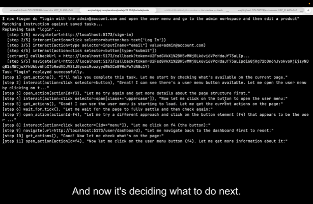

# fisgon

*__Fisgón__ (fee-SGOHN) is Spanish for "nosy person" — the kind who can't help but peek through the window to see what's going on.*

<p align="center">
  
</p>

*That's exactly what this tool does. It watches every fetch request, every SQL query, every navigation event, every email your app sends — and it loves every second of it. Your app has no secrets from el fisgón.*

*100% of the code was written by Claude Opus. A human just pointed and said "make it snoop on everything." The fisgón obliged.*

---

Low-level primitives for LLM-driven application testing.

Fisgon lets an LLM agent control a real browser while observing both client-side **and** server-side events. It captures every fetch request, navigation, SQL query, and custom event into **ticks** — groups of events collected during silence — giving the agent a complete picture of what happened after each action.

## How it works

<p align="center">
  <a href="https://x.com/i/status/2020660017272365349">
    
  </a>
  <br />
  <a href="https://x.com/i/status/2020660017272365349">Watch demo</a>
</p>

1. **Start a session** — Fisgon launches a browser and connects probes
2. **Give an instruction** — An LLM agent navigates the app like a real user, discovering links, filling forms, and clicking buttons
3. **Observe everything** — Browser probes capture fetch traffic and navigation; server probes capture SQL queries and custom events (e.g. email content, background jobs)
4. **Save and replay** — The agent's trace is distilled into a deterministic YAML task file that can be replayed without an LLM

```
fisgon start                                   # launch browser + session
fisgon do "Sign up and verify email" --save-task signup  # LLM does it, saves task
fisgon run signup                              # replay without LLM
```

## Install

```bash
npm install @upbeat-works/fisgon
```

### Wrangler config

Fisgon's agent runs locally via `wrangler dev`. Create a `wrangler.jsonc` in your project root:

```jsonc
{
  "name": "fisgon-agent",
  "main": "node_modules/@upbeat-works/fisgon/dist/agent/worker.js",
  "compatibility_date": "2025-01-01",
  "durable_objects": {
    "bindings": [{ "name": "AGENT", "class_name": "Agent" }]
  },
  "migrations": [
    { "tag": "v1", "new_sqlite_classes": ["Agent"] }
  ]
}
```

Then add a `.dev.vars` file next to it with your API keys. The agent routes LLM calls through Cloudflare AI Gateway, so you'll need:

```
ACCOUNT_ID=your-cloudflare-account-id
AI_GATEWAY=your-ai-gateway-name
AI_GATEWAY_TOKEN=your-api-token
```

> If your wrangler config lives somewhere other than the project root (e.g. in a monorepo), set `wrangler` in your fisgon config to the relative path.

### Remote agent

Instead of running the agent locally, you can deploy it to Cloudflare Workers and connect to it remotely. This skips the local wrangler setup entirely — no `wrangler.jsonc` or `.dev.vars` needed in your project.

```bash
# via CLI flag
fisgon start --agent wss://fisgon.example.workers.dev

# or in fisgon.config.ts
export default defineConfig({
  url: 'http://localhost:3000',
  agent: 'wss://fisgon.example.workers.dev',
})
```

When `agent` is set, `fisgon start` and `fisgon run` connect directly to the remote Durable Object over WebSocket. Use the `--env` flag to target a specific instance (e.g. `--env staging`, `--env pr-123`).

## CLI

```bash
fisgon start [options]              # Start a session with browser
fisgon do <instruction> [options]   # LLM agent performs a task
fisgon run <task-name> [options]    # Replay a saved task
fisgon navigate <url> [options]     # Navigate to a URL
fisgon actions                      # List interactive elements on page
fisgon interact <selector> [options] # Interact with an element
fisgon tick [options]               # Wait for next tick
fisgon events                       # View all session events
fisgon open <actionId>              # Inspect an action's HTML
fisgon stop                         # Stop the session
```

### `fisgon start`

| Flag | Description |
|------|-------------|
| `-p, --port <port>` | Agent port (default: `9876`) |
| `--agent <url>` | Remote agent URL (skips local wrangler) |
| `--env <name>` | Durable Object instance name (default: `default`) |
| `--remote` | Use remote Browser Rendering instead of local Playwright |
| `--no-browser` | Skip launching browser |
| `--identity <entries...>` | Session identities as `name:email:password` (can specify multiple) |

### `fisgon do`

The `do` command first checks your saved tasks — if any match the instruction, they're replayed automatically. Any remaining instruction is passed to the LLM.

### `fisgon run`

| Flag | Description |
|------|-------------|
| `--fallback` | Fall back to LLM if a step fails or validation doesn't pass |
| `--verbose` | Print each step as it executes |
| `--headless` | Run browser without visible window |
| `--list` | List all saved tasks and cases |

### `fisgon navigate`

| Flag | Description |
|------|-------------|
| `--as <identity>` | Log in as a named identity before navigating |

## Configuration

Create a `fisgon.config.ts` (or `.js` / `.mjs`) in your project root:

```typescript
import { defineConfig } from '@upbeat-works/fisgon'

export default defineConfig({
  url: 'http://localhost:3000',
  loginUrl: '/login',
  identity: {
    admin: { email: 'admin@example.com', password: 'secret' },
  },
  probes: {
    fetch: { match: ['/api/**'] },
    navigation: true,
  },
  tick: {
    silenceMs: 500,  // wait 500ms of silence to close a tick
    maxMs: 30000,    // max tick duration
  },
  // wrangler: 'packages/app/wrangler.jsonc',  // custom wrangler config path
})
```

## Server-side probes

Fisgon can observe your server too. Add a probe to capture SQL queries and custom events:

```typescript
import { createProbe } from '@upbeat-works/fisgon/server'

const probe = createProbe({ url: 'http://localhost:9876' })

// In your request handler:
const scoped = probe.fromRequest(request)
scoped.fromSQL('INSERT INTO users ...')
scoped.emit({ source: 'email', type: 'sent', timestamp: Date.now(), data: { to, subject, text } })
```

## Task files

Tasks live in `.fisgon/tasks/` as YAML:

```yaml
name: login
description: Log in with email and password
params:
  email: admin@example.com
  password: secret
steps:
  - tool: navigate
    args:
      url: "{{loginUrl}}"
  - tool: interact
    args:
      action: type
      selector: input[name="email"]
      value: "{{email}}"
  - tool: interact
    args:
      action: type
      selector: input[name="password"]
      value: "{{password}}"
  - tool: interact
    args:
      action: click
      selector: button[type="submit"]
validate:
  url_contains: /dashboard
```

### Parameters

All string values in `args` support `{{param}}` placeholders. Default values are defined in `params` and can be overridden at runtime.

### Extract

Steps can extract dynamic values from tick events for use in later steps:

```yaml
steps:
  - tool: interact
    args:
      action: click
      selector: button[type="submit"]
  - tool: wait_for_tick
    extract:
      callbackUrl: "events[source=email].data.text | match(/http\\S+callback\\S+/)"
  - tool: navigate
    args:
      url: "{{callbackUrl}}"
```

Supported expression formats:
- `events[source=X].data.field` — find event by source, traverse path
- `events[source=X].data.text | match(/regex/)` — find event, extract regex match
- `data.field.subfield` — simple dot-path traversal

### Validation

Tasks can validate the result after all steps complete:

```yaml
validate:
  url_contains: /dashboard           # final URL contains substring
  url_matches: "/users/\\d+"         # final URL matches regex
  event_exists:                      # a matching event was emitted
    source: email
    type: sent
```

When using `--fallback`, a failed validation causes the LLM to re-attempt the entire task.

## Test cases

Cases live in `.fisgon/cases/` and compose multiple tasks into a sequence:

```yaml
name: full_signup
description: Complete user signup and email verification
tasks:
  - signup
  - verify_email
  - complete_profile
```

Run with `fisgon run full_signup` — tasks execute in order, stopping on the first failure. Use `fisgon run --list` to see all available tasks and cases.

## Architecture

```
CLI ──────────────┐
                  │  WebSocket
Browser probes ───┤──────────── Agent (Cloudflare Durable Object)
                  │                 ├── Event ingestion
                  │                 ├── Tick detection
Server probes ────┘  HTTP POST      ├── SQLite session store
                                    └── LLM task execution
```

The agent runs locally via `wrangler dev` or remotely on Cloudflare Workers. The CLI and browser probes connect over WebSocket; server probes send events via HTTP POST. The browser gets instrumented with injected scripts that track fetch requests, navigation, and interactive elements.

## License

[O'Saasy License](LICENSE.md) — free to use, modify, and distribute; cannot be offered as a competing SaaS product.
